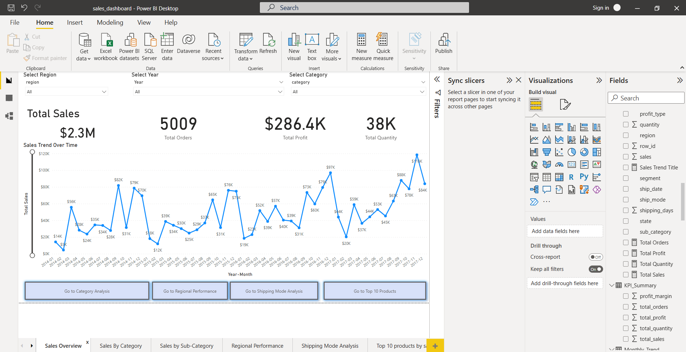

# 📊 Sales & Business Performance Analysis

## 🔹 Project Overview
This is an end-to-end data analytics project focused on analyzing business performance using retail sales data.

The project combines:
- SQL for data extraction, cleaning, and analysis
- Power BI for interactive dashboarding and visualization

---

## 🔹 Tools & Technologies
- SQL (MySQL Workbench)
- Power BI
- Excel / CSV dataset

---

## 🔹 Project Objectives
- Analyze total sales, profit, orders, and quantity
- Identify top-performing products and categories
- Understand regional performance
- Explore time-based sales trends
- Evaluate shipping mode performance

---

## 🔹 SQL Analysis

SQL was used to:

- Clean and prepare the dataset
- Calculate KPIs (Sales, Profit, Orders)
- Perform category and sub-category analysis
- Analyze regional performance
- Generate time-based trends

📂 SQL scripts are available in the `sql/` folder

---

## 🔹 Power BI Dashboard

The Power BI dashboard includes:

- KPI cards (Sales, Profit, Orders, Quantity)
- Sales trend over time
- Category and sub-category analysis
- Regional performance analysis
- Shipping mode analysis
- Top 10 products analysis
- Drill-through pages for detailed insights

📂 Power BI file available in `powerbi/`

---

## 🔹 Dashboard Preview

### Sales Overview

### Category Analysis

### Sub-Category Analysis

### Regional Performance

### Product Analysis

---

## 🔹 Key Insights

- Technology category generates the highest revenue
- A small number of products contribute to a large portion of total sales
- West region shows strong overall performance
- Standard shipping mode is the most frequently used
- Sales show consistent variation over time with identifiable peaks

---

## 🔹 Conclusion

This project demonstrates an end-to-end analytics workflow:
from raw data → SQL analysis → interactive Power BI dashboard.

It highlights both technical skills and business insight generation.

---
---

## 🔹 Project Structure
